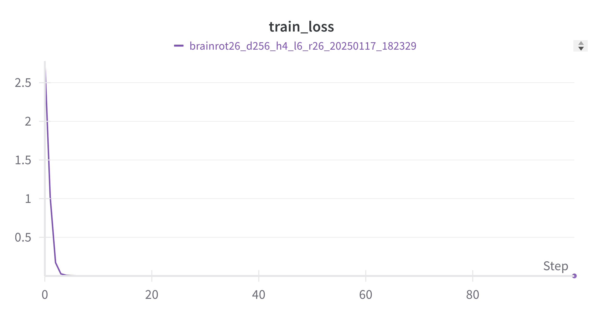

# brainROTx

We present brainROTx, a groundbreaking suite of large language models designed to revolutionize the field of cryptography. By leveraging the power of neural networks and traditional ROT-based encryption, we demonstrate unprecedented capabilities in secure text transformation. Our architecture consists of three SOTA models of increasing complexity, each implementing progressively sophisticated ROT operations :
- brainrot26 (4M parameters, d_model=256, d_ff=1024, num_heads=4, num_layers=6)
- brainrot52 (14M parameters, d_model=384, d_ff=1536, num_heads=6, num_layers=8)
- brainrot104 (31M parameters, d_model=512, d_ff=2048, num_heads=8, num_layers=10)



## Training

```sh
./train_brainrot26.sh
```

```sh
./train_brainrot52.sh
```

```sh
./train_brainrot104.sh
```

## Usage

`python cli.py --model_path <model_path> --text <text> --device <device(cpu/cuda)>`

Example:

```sh
python cli.py --model_path models/brainrot26.pt --text test --device cpu
```

## Contibutors

- [JL²](https://github.com/JLsquare)
- [LituDev](https://github.com/litudev)
